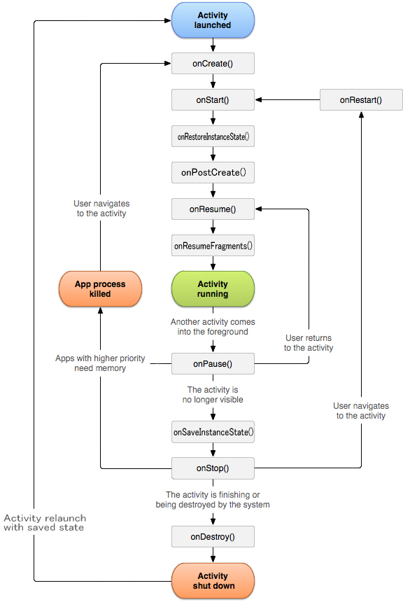

## About for Android

---

### まずAndroidとは？

Googleが開発したモバイル向けOS
現在はIoTなど組み込み向けとも謳っている

+++

### してその特徴は？

モバイル向けにパフォーマンス調整されたAndroid Runtime（ART）という仮想マシンで動作している

---

### Android OS のバージョンとそのシェア

Android 11.0
Andorid 10.0

---

### リリースの流れ

1. APKファイルをAndroid Studioでビルド
2. Google Play Consoleでリリース情報を編集
3. APKファイルをアップロード
4. 公開

---

### Androidのライフサイクル

基本的にはActivityという単位でアプリケーションが構成されています。
一つのActivityで一つのアプリケーションなのですが、
１つのアプリケーションに複数のActivityが入ります。

+++

